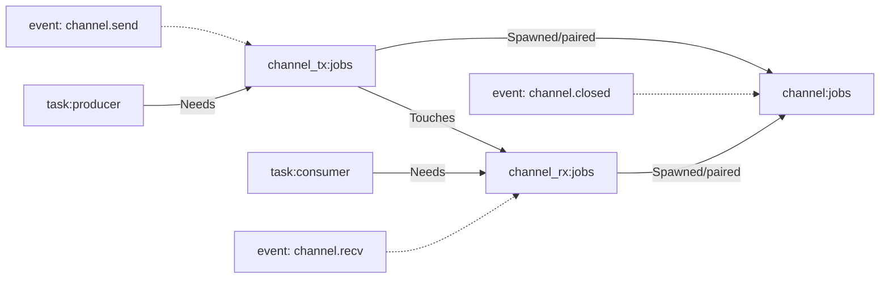

+++
title = "Concepts"
weight = 1
sort_by = "weight"
insert_anchor_links = "heading"
+++

peeps models runtime behavior as a graph plus a timeline. Nodes are runtime entities. Edges are causal relationships between those entities. Events are timestamped facts about lifecycle and activity.

A Node is anything that exists at runtime and can participate in causality: a task, a lock, a channel endpoint, a request, a response, a process-level operation. Node identity is stable. Node attrs are observational detail. Inspector-facing attrs must keep canonical keys, with `created_at` and `source` always present.

An Edge says one node is causally related to another. Edges are directional. Edge kind carries meaning, like dependency, interaction, lineage, or closure cause. Edges appear and disappear as runtime state changes. See [Edges](@/concepts/edges.md) for edge-kind semantics.

An Event records something that happened at a point in time for a node. Events are where lifecycle and phase transitions belong. The event row shape, naming contract, and taxonomy live in [Events](@/concepts/events.md).

The rest of this section explains how to read this model in practice: lifecycle behavior, timing semantics, edge semantics, and event naming.

## Example: Channel

You create a channel, one task sends, another task receives, and eventually someone closes. In peeps terms, that shows up as channel endpoint nodes plus task nodes, with edges for who depends on what and events for send/recv/close activity over time.

